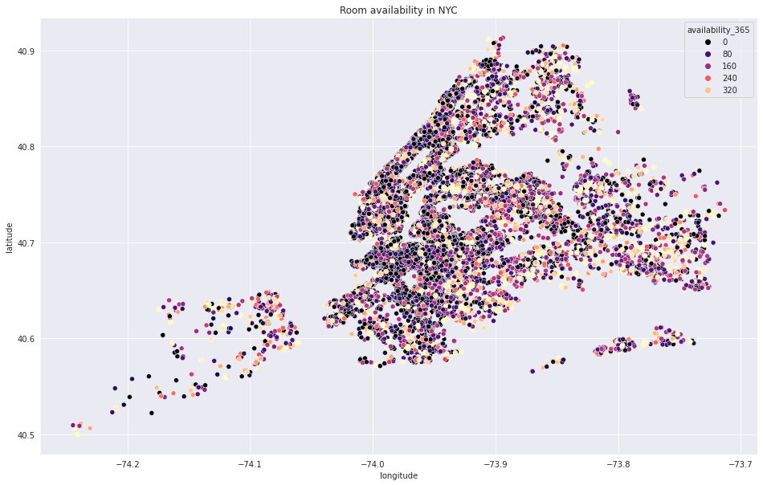
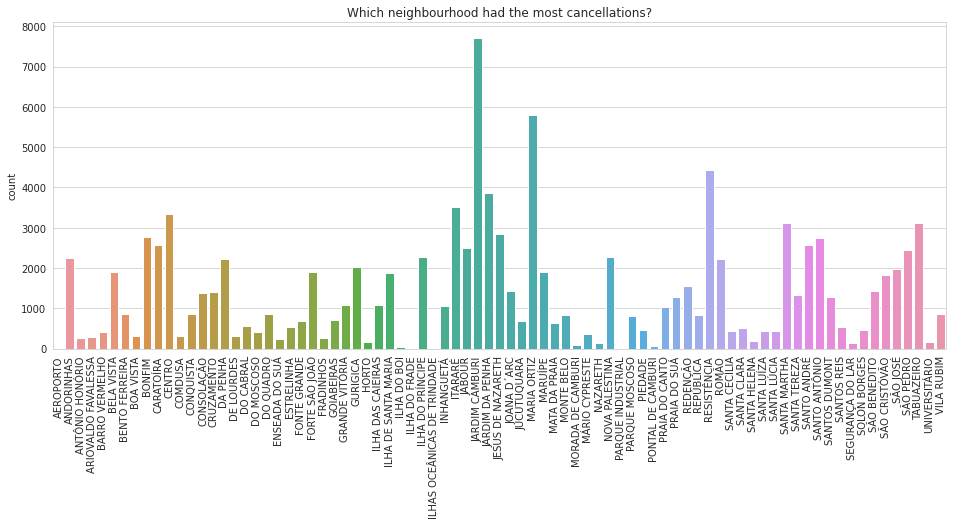

# Data Science Portfolio
This is a compilation of all the Data Science and Data Analysis projects I have done for academic
and self-learning purposes.
 
 

 
 
 

[AirBNB NYC](https://github.com/darkMatterChimpanzee/Data-Science-Portfolio/tree/main/AirBNB%20NYC)

Since 2008, guests and hosts have used Airbnb to expand on traveling possibilities and present more unique, 
personalized way of experiencing the world. This dataset describes the listing activity and metrics in NYC, NY for 2019. 

What can we learn about different hosts and areas? What can we learn from predictions? (ex: locations, 
prices, reviews, etc) Which hosts are the busiest and why? Is there any noticeable difference of traffic among 
different areas and what could be the reason for it?

 
 
 

 
 
 

[Product Review Analysis](https://github.com/darkMatterChimpanzee/Data-Science-Portfolio/tree/main/Product%20Review%20Analysis) 

This is a list of over 34,000 consumer reviews for Amazon products like the Kindle, Fire TV Stick, and more 
provided by Datafiniti's Product Database. The dataset includes basic product information, rating, review text, and 
more for each product. Analysis uses NLP and word clouds to find out polarity in reviews and recommendation percentages

 
 
 

 
 
 

[Appointment No Shows](https://github.com/darkMatterChimpanzee/Data-Science-Portfolio/tree/main/Appointment%20No-Shows)

A person makes a doctor appointment, receives all the instructions and no-show. Who to blame?

